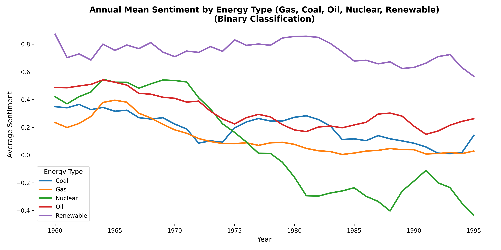

# Interest

# Sentiment Analysis of Historical News Articles

This repository contains code for **sentiment analysis of historical news articles**, with a primary focus on energy-related topics. Although initially developed and tested on the [Delpher Kranten](https://www.delpher.nl/nl/kranten) archive, the code is adaptable and can be used to analyze the sentiment of any textual dataset.

Using the [dataQuest](https://github.com/UtrechtUniversity/dataQuest) Python package, this project filters and processes articles related to **fossil fuels** (gas, coal, oil), **nuclear**, and **renewable energy**. The aim is to investigate the evolving sentiment toward these energy sources in Dutch newspapers between **1960 and 1995**.

The repository leverages the `interest` Python package, which provides a range of sentiment analysis methods optimized for historical and Dutch-language text.



## Key Features of the `interest` Package

- Fine-tuning of Dutch BERT models such as **GysBERT**, **BERTje**, and **RobBERT**
- Sentiment scoring using **masked language modeling**
- An **unsupervised document embedding** method that estimates sentiment by computing **Euclidean distances** between article vectors and sentiment word vectors
- Traditional machine learning models like **SVM** and **Logistic Regression**
- **Explainability of the models** using attribution-based methods to highlight key tokens that influence predictions

---

## Getting Started
Clone this repository to your working station to obtain python scripts:

```https://github.com/UtrechtUniversity/historical-news-sentiment.git```

## Prerequisites

```
- Python [>=3.11]
- jupyterlab (or any other program to run jupyter notebooks)
```
To install jupyterlab:

``` pip install jupyterlab```

## Installation

To run the project, make sure you have Python 3.11+ installed. Then, install the required dependencies by running the following command from the root directory:

```bash
pip install -e .
```

## Usage

### Train
To train a BERT model, run the following:

```bash
python script/fine_tune.py train \
  --train_fp "<path_to_training_file>" \
  --output_dir "<path_to_output_directory>" \
  --model_name "<huggingface_model_name>" \
  --num_labels <number_of_classes>
 ```

--train_fp: Path to your training CSV file

--output_dir: Directory to save model checkpoints and logs

--model_name: Any model available on Hugging Face (e.g., bert-base-uncased, emanjavacas/GysBERT-v2)

--num_labels: Number of classification labels (e.g., 2 for binary, 3 for ternary)

Note: These are the required parameters for training.
Other optional parameters such as --chunk_method, --batch_size, --stride, etc.
can be found and customized in script/fine_tune.py.

### Prediction
To run a prediction on an unlabeled dataset

```bash
python script/fine_tune.py predict \
  --test_fp "<path_to_test_file?" \
  --lowercase <True_or_False> \
  --freeze <True_or_False> \
  --batch_size <batch_size> \
  --text_field_name "<text_field_name>" \
  --label_field_name "" \
  --output_dir "<output_dir>" \
  --model_name "<huggingface_model_name>" \
  --model_path "<path_to_fine_tuned_model>" \
  --num_labels <number_of_classes>
```
Important Notes

--batch_size, --freeze, and --lowercase must match the configuration used during model fine-tuning:
If the model was trained with frozen layers, use --freeze True.
If the model was fine-tuned using lowercased text, set --lowercase True. 
Use the same --batch_size for consistency and compatibility.

To predict on a labeled dataset, provide the --label_field_name argument (e.g., --label_field_name "label"), 
otherwise, set ""

### Explainability
You can generate explanations for model predictions using the explain mode. 
This will create HTML file showing which tokens influenced the model's decision
in a specific article.

To run:
```bash
python script/fine_tune.py explain \
--test_fp "<path_to_test_file>.csv" \
--output_dir "<output_directory>" \
--output_htmlfile "<html_file_base_name>" \
--model_name "<huggingface_model_name>" \
--model_path "<path_to_trained_model_checkpoint>" \
--label_field_name "<label_column_name>" \
--num_labels <number_of_labels> \
--lowercase <True_or_False> \
--freeze <True_or_False> \
--batch_size <batch_size>
``` 
Note:

The values for --lowercase, --freeze, and --batch_size must match the settings used during fine-tuning.
The test file must include both the text and label columns.

## About the Project

### Date: May 2024

### Researcher(s):

- Pim Huijnen (p.huijnen@uu.nl)
- Anastasia Giachanou (a.giachanou@uu.nl)

### Research Software Engineer(s):

- Parisa Zahedi (p.zahedi@uu.nl)

- Shiva Nadi (s.nadi@uu.nl) 
## License

The code in this project is released under [MIT license](https://github.com/UtrechtUniversity/patent-breakthrough/blob/main/LICENSE).

## Contributing

Contributions are what make the open source community an amazing place to learn, inspire, and create. Any contributions you make are greatly appreciated.

### To contribute:

- Fork the Project
- Create your Feature Branch (git checkout -b feature/AmazingFeature)
- Commit your Changes (git commit -m 'Add some AmazingFeature')
- Push to the Branch (git push origin feature/AmazingFeature)
- Open a Pull Request

## Contact

Pim Huijnen - p.huijnen@uu.nl

Project Link:  https://github.com/UtrechtUniversity/historical-news-sentiment.git
